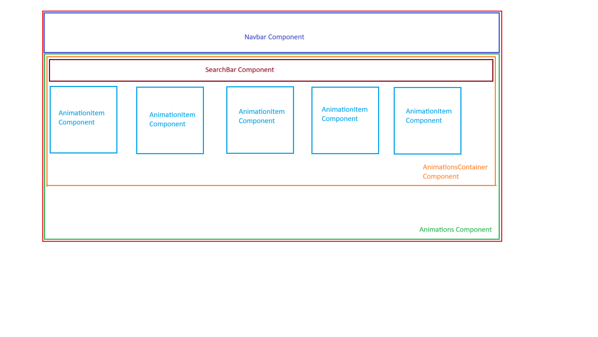

# Welcome to Flames! Your animation buddy.

## Development

Run the dev server:

```shellscript
npm run dev
```

## Deployment

First, build your app for production:

```sh
npm run build
```

Builds the app for production to the `build` folder.\
It correctly bundles React in production mode and optimizes the build for the best performance.

The build is minified and the filenames include the hashes.\
Your app is ready to be deployed!

```sh
npm start
```

Now you'll need to pick a host to deploy it to.

```sh
npm run eject
```

**Note: this is a one-way operation. Once you `eject`, you can’t go back!**

If you aren’t satisfied with the build tool and configuration choices, you can `eject` at any time. This command will remove the single build dependency from your project.

Instead, it will copy all the configuration files and the transitive dependencies (webpack, Babel, ESLint, etc) right into your project so you have full control over them. All of the commands except `eject` will still work, but they will point to the copied scripts so you can tweak them. At this point you’re on your own.

You don’t have to ever use `eject`. The curated feature set is suitable for small and middle deployments, and you shouldn’t feel obligated to use this feature. However we understand that this tool wouldn’t be useful if you couldn’t customize it when you are ready for it.

This application is front-end part of the E2E application. You need to run `flames-node` as a backend server.

Make sure to deploy the output of `npm run build`

- `build/`

## Styling

This application uses [Tailwind CSS](https://tailwindcss.com/) for styling.

## Persistent Storage

See the `flames-node` documentation for more details.

## Application Layout and Function

At high level, the screen layout is divided into the various React components as shown below:



`Create New Animation` and `View Animation Metadata`, these two operations are supported through modal popup.

1. While creating a new animation, you need to select the `.json` file and enter all the metadata of the animation. Note, the dimension is in `[WIDTH]x[HEIGHT]` format.
2. To view the animation metadata, you need to click on `info` icon on individual animation item.
3. The animation definition can be downloaded in `.json` format only.

Future Scope:

1. Pagination
2. Better Error handling
3. `.lottie` file support for upload and download.
