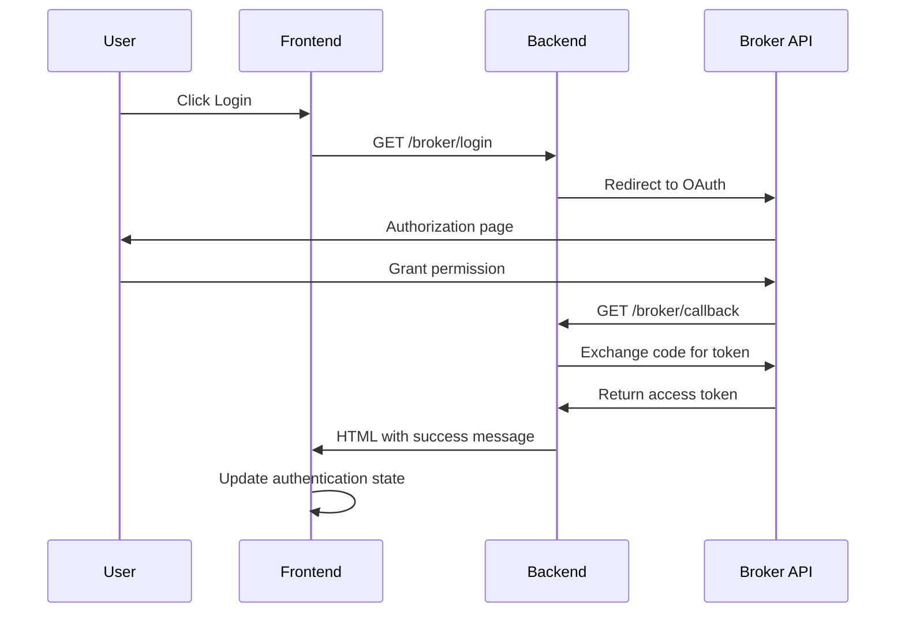

# Trading API - Production Ready Flask Backend

A production-ready Flask API for trading and market data integration with multiple brokers (Fyers, Dhan, Binance).

## 🚀 Features

- **Multi-Broker Support**: Fyers, Dhan, Binance integration
- **Market Data**: Real-time and historical data from multiple brokers
- **Production Ready**: Rate limiting, logging, error handling, security headers
- **Containerized**: Docker and Docker Compose support
- **Monitoring**: Health checks, structured logging, Sentry integration
- **Testing**: Comprehensive test suite
- **Documentation**: Auto-generated API documentation

## 📋 Prerequisites

- Python 3.11+
- Docker and Docker Compose
- Redis (for session storage and rate limiting)

## 🛠️ Installation

### Development Setup

1. **Clone the repository**
   ```bash
   git clone <your-repo-url>
   cd backend
   ```

2. **Create virtual environment**
   ```bash
   python -m venv venv
   source venv/bin/activate  # On Windows: venv\Scripts\activate
   ```

3. **Install dependencies**
   ```bash
   pip install -r requirements.txt
   ```

4. **Set up environment variables**
   ```bash
   cp .env.example .env
   # Edit .env with your configuration
   ```

5. **Start Redis**
   ```bash
   docker run -d -p 6379:6379 redis:7-alpine
   ```

6. **Run the application**
   ```bash
   python app.py
   ```

### Production Deployment

1. **Using Docker Compose (Recommended)**
   ```bash
   # Set up environment variables
   cp .env.example .env
   # Edit .env with production values
   
   # Deploy
   ./scripts/deploy.sh
   ```

2. **Manual Docker Deployment**
   ```bash
   docker build -t trading-api .
   docker run -p 8000:8000 --env-file .env trading-api
   ```

3. **Using Gunicorn**
   ```bash
   gunicorn --config gunicorn.conf.py app:app
   ```

## 🔧 Configuration

### Environment Variables

| Variable | Description | Default |
|----------|-------------|---------|
| `FLASK_ENV` | Environment (development/production) | development |
| `SECRET_KEY` | Flask secret key | dev-secret-key |
| `REDIS_URL` | Redis connection URL | redis://localhost:6379/0 |
| `BINANCE_API_KEY` | Binance API key | - |
| `BINANCE_API_SECRET` | Binance API secret | - |

| `SENTRY_DSN` | Sentry DSN for error monitoring | - |
| `CORS_ORIGINS` | Allowed CORS origins | http://localhost:3000 |

### Production Checklist

- [ ] Set strong `SECRET_KEY`
- [ ] Configure API keys for brokers
- [ ] Set up Redis for session storage
- [ ] Configure CORS origins
- [ ] Set up Sentry for error monitoring
- [ ] Configure rate limiting
- [ ] Set up SSL/TLS certificates
- [ ] Configure logging
- [ ] Set up monitoring and alerting

## 📚 API Documentation

### Base URL
```
http://localhost:8000
```

### Endpoints

#### Health Check
```http
GET /health
```

#### API Documentation
```http
GET /api/docs
```

#### Market Data

**Get Gainers and Losers**
```http

```

**Get Historical Data**
```http

Content-Type: application/json

{
  "symbol": "RELIANCE",
  "interval": "1d",
  "exchange": "NSE",
  "start": "2024-01-01",
  "end": "2024-01-31"
}
```

**Get Real-time Data**
```http

Content-Type: application/json

{
  "symbol": "RELIANCE",
  "exchange": "NSE"
}
```

#### Broker Integration

**Fyers Authentication**
```http
GET /fyers/login?client_id=YOUR_CLIENT_ID&secret_key=YOUR_SECRET_KEY
```

**Dhan Authentication**
```http
GET /dhan/login?client_id=YOUR_CLIENT_ID&secret_key=YOUR_SECRET_KEY
```

**Binance Data**
```http
GET /binance/data?symbol=BTCUSDT&interval=1h
```

## 🧪 Testing

Run the test suite:

```bash
# Run all tests
pytest

# Run with coverage
pytest --cov=.

# Run specific test file
pytest tests/test_app.py

# Run with verbose output
pytest -v
```

## 📊 Monitoring

### Health Checks
- **Endpoint**: `/health`
- **Checks**: Redis connectivity, API responsiveness
- **Response**: JSON with status and timestamp

### Logging
- **Format**: Structured JSON logging
- **Level**: Configurable via `LOG_LEVEL`
- **Output**: stdout/stderr for containerized deployment

### Error Monitoring
- **Sentry**: Automatic error tracking and alerting
- **Custom Errors**: Structured error responses
- **Rate Limiting**: Protection against abuse

## 🔒 Security

### Implemented Security Features

- **Rate Limiting**: Configurable per endpoint
- **CORS**: Properly configured for production
- **Security Headers**: XSS protection, content type options
- **Session Security**: Secure cookies, Redis storage
- **Input Validation**: Request validation and sanitization
- **Error Handling**: No sensitive information in error messages

### Security Best Practices

1. **Environment Variables**: Never commit secrets to version control
2. **HTTPS**: Always use HTTPS in production
3. **API Keys**: Rotate API keys regularly
4. **Access Control**: Implement proper authentication
5. **Monitoring**: Monitor for suspicious activity

## 🚀 Deployment

### Docker Compose (Recommended)

```bash
# Start all services
docker-compose up -d

# View logs
docker-compose logs -f

# Stop services
docker-compose down

# Update and restart
docker-compose up -d --build
```

### Production Considerations

1. **Load Balancing**: Use nginx or similar for load balancing
2. **SSL/TLS**: Configure HTTPS with proper certificates
3. **Database**: Consider using PostgreSQL for persistent data
4. **Caching**: Implement Redis caching for frequently accessed data
5. **Monitoring**: Set up Prometheus/Grafana for metrics
6. **Backup**: Regular backups of Redis data
7. **Updates**: Automated deployment pipeline

## 🐛 Troubleshooting

### Common Issues

1. **Redis Connection Failed**
   ```bash
   # Check if Redis is running
   docker ps | grep redis
   
   # Restart Redis
   docker-compose restart redis
   ```

2. **Rate Limiting Issues**
   - Check Redis connectivity
   - Verify rate limit configuration
   - Monitor request patterns

3. **API Key Issues**
   - Verify environment variables
   - Check broker API credentials
   - Validate API key permissions

4. **CORS Issues**
   - Verify `CORS_ORIGINS` configuration
   - Check frontend domain settings

### Debug Mode

```bash
# Enable debug mode
export FLASK_ENV=development
export FLASK_DEBUG=1

# Run with debug
python app.py
```

## 📈 Performance

### Optimization Tips

1. **Database**: Use connection pooling
2. **Caching**: Implement Redis caching for market data
3. **Async**: Consider async/await for I/O operations
4. **Compression**: Enable gzip compression
5. **CDN**: Use CDN for static assets

### Monitoring Metrics

- Request rate and response times
- Error rates and types
- Memory and CPU usage
- Database connection pool status
- External API response times

## 🤝 Contributing

1. Fork the repository
2. Create a feature branch
3. Make your changes
4. Add tests for new functionality
5. Run the test suite
6. Submit a pull request

## 📄 License

This project is licensed under the MIT License - see the LICENSE file for details.

## 🆘 Support

For support and questions:
- Create an issue in the repository
- Check the API documentation at `/api/docs`
- Review the logs for error details
- Contact the development team 

# Broker Modular Architecture Documentation

## Overview

The broker integration has been completely modularized into separate files for each broker (Fyers, Dhan, Binance) with clean separation of concerns and unified routing through the main application.

## Architecture Structure

```
backend/
├── main.py              # Main Flask app with unified routing
├── fyers.py             # Fyers OAuth + Market Data APIs
├── dhan.py              # Dhan OAuth + Market Data APIs
├── binance.py           # Binance Market Data APIs
└── README.md            # Setup instructions
```

## File Responsibilities

### 🔧 **main.py** - Unified Router
- **Purpose**: Central routing and broker selection logic
- **Features**:
  - Unified endpoints for Indian market data
  - Smart broker selection (Fyers → Dhan → Mock)
  - Fallback mechanisms
  - Mock data generation

### 🔗 **fyers.py** - Fyers Integration
- **Purpose**: Complete Fyers broker integration
- **Features**:
  - OAuth 2.0 authentication flow
  - Market data APIs (historical, real-time)
  - Order placement and management
  - Account information and positions

### 🔗 **dhan.py** - Dhan Integration
- **Purpose**: Complete Dhan broker integration
- **Features**:
  - OAuth 2.0 authentication flow
  - Market data APIs (historical, real-time)
  - Order placement and management
  - Account information and positions

### 🔗 **binance.py** - Binance Integration
- **Purpose**: Complete Binance integration
- **Features**:
  - Market data APIs (historical, real-time)
  - Order placement and management
  - Account information and positions
  - Crypto trading functionality

## API Endpoints Structure

### 📊 **Unified Indian Market Data Endpoints** (main.py)

| Endpoint | Method | Purpose | Broker Priority |
|----------|--------|---------|-----------------|
| `/indian-market-data` | GET | Historical data | Fyers → Dhan → Mock |
| `/indian-market-data/realtime` | GET | Real-time data | Fyers → Dhan → Mock |
| `/indian-market-data/placeorder` | POST | Place orders | Fyers → Dhan → Error |
| `/indian-market-data/account` | GET | Account info | Fyers → Dhan → Error |
| `/indian-market-data/positions` | GET | Positions | Fyers → Dhan → Error |
| `/indian-market-data/orders` | GET | Open orders | Fyers → Dhan → Error |

### 🔐 **Fyers OAuth Endpoints** (fyers.py)

| Endpoint | Method | Purpose |
|----------|--------|---------|
| `/fyers/login` | GET | Initiate OAuth |
| `/fyers/callback` | GET | OAuth callback |
| `/fyers/status` | GET | Authentication status |
| `/fyers/logout` | GET | Logout |
| `/fyers/api-status` | GET | API connectivity |

### 🔐 **Dhan OAuth Endpoints** (dhan.py)

| Endpoint | Method | Purpose |
|----------|--------|---------|
| `/dhan/login` | GET | Initiate OAuth |
| `/dhan/callback` | GET | OAuth callback |
| `/dhan/status` | GET | Authentication status |
| `/dhan/logout` | GET | Logout |
| `/dhan/api-status` | GET | API connectivity |

### 📈 **Fyers Market Data Endpoints** (fyers.py)

| Endpoint | Method | Purpose |
|----------|--------|---------|
| `/fyers/market-data/historical` | GET | Historical OHLCV data |
| `/fyers/market-data/realtime` | GET | Real-time quotes |
| `/fyers/market-data/order` | POST | Place orders |
| `/fyers/market-data/account` | GET | Account information |
| `/fyers/market-data/positions` | GET | Current positions |
| `/fyers/market-data/orders` | GET | Open orders |

### 📈 **Dhan Market Data Endpoints** (dhan.py)

| Endpoint | Method | Purpose |
|----------|--------|---------|
| `/dhan/market-data/historical` | GET | Historical OHLCV data |
| `/dhan/market-data/realtime` | GET | Real-time quotes |
| `/dhan/market-data/order` | POST | Place orders |
| `/dhan/market-data/account` | GET | Account information |
| `/dhan/market-data/positions` | GET | Current positions |
| `/dhan/market-data/orders` | GET | Open orders |

### 📈 **Binance Market Data Endpoints** (binance.py)

| Endpoint | Method | Purpose |
|----------|--------|---------|
| `/binance/data` | GET | Historical OHLCV data |
| `/binance/realtime` | GET | Real-time quotes |
| `/binance/order` | POST | Place orders |
| `/binance/account` | GET | Account information |
| `/binance/orders` | GET | Open orders |
| `/binance/order/cancel` | POST | Cancel orders |
| `/binance/status` | GET | API status |

## Routing Logic

### 🎯 **Smart Broker Selection**

The main.py file implements intelligent broker selection:

```python
# Priority-based broker selection
if is_fyers_authenticated():
    # Try Fyers first
    response = requests.get("http://127.0.0.1:8000/fyers/market-data/historical")
    if response.status_code == 200:
        return response.json()
elif is_dhan_authenticated():
    # Try Dhan if Fyers fails
    response = requests.get("http://127.0.0.1:8000/dhan/market-data/historical")
    if response.status_code == 200:
        return response.json()
else:
    # Fallback to mock data
    return generate_mock_indian_data()
```

### 🔄 **Fallback Mechanisms**

1. **Primary**: Authenticated broker APIs
2. **Secondary**: Mock data generation
3. **Error Handling**: Graceful error responses

## Authentication Flow

### 🔐 **OAuth 2.0 Flow**



### 🛡️ **Session Management**

Each broker maintains its own session:

```python
# Fyers session
fyers_session = {
    'access_token': 'token_here',
    'client_id': 'client_id',
    'profile': {...}
}

# Dhan session
dhan_session = {
    'access_token': 'token_here',
    'client_id': 'client_id',
    'profile': {...}
}
```

## Data Flow Examples

### 📊 **Historical Data Request**

```javascript
// Frontend request
fetch('/indian-market-data?symbol=RELIANCE&interval=1h')

// Backend routing
GET /indian-market-data
├── Check Fyers authentication
├── If authenticated: GET /fyers/market-data/historical
├── If failed: Check Dhan authentication
├── If authenticated: GET /dhan/market-data/historical
└── If failed: Return mock data
```

### 💰 **Order Placement**

```javascript
// Frontend request
fetch('/indian-market-data/placeorder', {
  method: 'POST',
  body: JSON.stringify({
    symbol: 'RELIANCE',
    quantity: 10,
    side: 'BUY',
    orderType: 'MARKET'
  })
})

// Backend routing
POST /indian-market-data/placeorder
├── Check Fyers authentication
├── If authenticated: POST /fyers/market-data/order
├── If failed: Check Dhan authentication
├── If authenticated: POST /dhan/market-data/order
└── If failed: Return error
```

## Error Handling

### 🚨 **Error Response Format**

```json
{
  "error": "Descriptive error message",
  "broker": "fyers|dhan|binance",
  "status_code": 400
}
```

### 🔧 **Common Error Scenarios**

1. **Authentication Required**:
   ```json
   {"error": "Fyers not authenticated", "status_code": 401}
   ```

2. **API Error**:
   ```json
   {"error": "Fyers API error: 400", "status_code": 400}
   ```

3. **No Brokers Available**:
   ```json
   {"error": "No authenticated brokers available", "status_code": 400}
   ```

## Configuration

### 🔧 **Environment Variables**

```bash
# Fyers Configuration
FYERS_CLIENT_ID=your_client_id
FYERS_SECRET_KEY=your_secret_key

# Dhan Configuration
DHAN_CLIENT_ID=your_client_id
DHAN_SECRET_KEY=your_secret_key

# Binance Configuration
BINANCE_API_KEY=your_api_key
BINANCE_API_SECRET=your_api_secret
```

### ⚙️ **Flask Configuration**

```python
app = Flask(__name__)
CORS(app, resources={r"/*": {"origins": ["http://localhost:5173"]}})
app.secret_key = "your_secret_key"

# Register broker blueprints
app.register_blueprint(fyers_bp, url_prefix='/fyers')
app.register_blueprint(dhan_bp, url_prefix='/dhan')
app.register_blueprint(binance_bp, url_prefix='/binance')
```

## Frontend Integration

### 🔗 **Chart Component Integration**

```javascript
// Automatic symbol detection and routing
const getApiEndpoint = (symbol, interval) => {
  if (isIndianStock(symbol)) {
    return `/indian-market-data?symbol=${symbol}&interval=${interval}`;
  } else {
    return `/binance/data?symbol=${symbol}&interval=${interval}`;
  }
};
```

### 💼 **Trading Component Integration**

```javascript
// Unified order placement
const placeOrder = async (orderData) => {
  const response = await fetch('/indian-market-data/placeorder', {
    method: 'POST',
    headers: { 'Content-Type': 'application/json' },
    body: JSON.stringify(orderData)
  });
  return response.json();
};
```

## Testing

### 🧪 **Unit Tests**

```python
def test_broker_selection():
    # Test Fyers priority
    assert get_broker_priority() == 'fyers'
    
    # Test Dhan fallback
    clear_fyers_session()
    assert get_broker_priority() == 'dhan'
    
    # Test mock fallback
    clear_dhan_session()
    assert get_broker_priority() == 'mock'
```

### 🔍 **Integration Tests**

```python
def test_end_to_end_flow():
    # 1. Authenticate with Fyers
    auth_response = authenticate_fyers()
    assert auth_response.status_code == 200
    
    # 2. Fetch market data
    data_response = fetch_market_data('RELIANCE')
    assert data_response.status_code == 200
    
    # 3. Place order
    order_response = place_order(order_data)
    assert order_response.status_code == 200
```

## Performance Optimization

### ⚡ **Caching Strategy**

```python
# Cache broker authentication status
@lru_cache(maxsize=1)
def get_authenticated_brokers():
    brokers = []
    if is_fyers_authenticated():
        brokers.append('fyers')
    if is_dhan_authenticated():
        brokers.append('dhan')
    return brokers
```

### 🔄 **Connection Pooling**

```python
# Reuse HTTP sessions
session = requests.Session()
session.mount('https://', HTTPAdapter(max_retries=3))
```

## Security Considerations

### 🔐 **API Key Management**

1. **Environment Variables**: Store sensitive data in environment variables
2. **Session Security**: Use secure session management
3. **Token Validation**: Validate tokens before API calls
4. **Error Sanitization**: Don't expose sensitive data in errors

### 🛡️ **Request Validation**

```python
def validate_order_data(order_data):
    required_fields = ['symbol', 'quantity', 'side']
    for field in required_fields:
        if field not in order_data:
            raise ValueError(f"Missing required field: {field}")
```

## Monitoring and Logging

### 📊 **API Usage Monitoring**

```python
import logging

logger = logging.getLogger(__name__)

def log_api_call(broker, endpoint, success=True):
    logger.info(f"API Call: {broker} | {endpoint} | Success: {success}")
```

### 📈 **Performance Metrics**

```python
import time

def measure_performance(func):
    def wrapper(*args, **kwargs):
        start_time = time.time()
        result = func(*args, **kwargs)
        end_time = time.time()
        logger.info(f"Function {func.__name__} took {end_time - start_time:.2f}s")
        return result
    return wrapper
```

## Troubleshooting

### 🔍 **Common Issues**

1. **Authentication Failures**:
   - Check API credentials
   - Verify OAuth redirect URIs
   - Check session management

2. **API Rate Limits**:
   - Implement exponential backoff
   - Use connection pooling
   - Monitor API usage

3. **Network Issues**:
   - Check internet connectivity
   - Verify API endpoints
   - Implement retry logic

### 🛠️ **Debug Mode**

```python
# Enable debug logging
logging.basicConfig(level=logging.DEBUG)

# Enable Flask debug mode
app.run(debug=True)
```

## Future Enhancements

### 🚀 **Planned Features**

1. **WebSocket Integration**:
   - Real-time data streaming
   - Live order updates
   - Market depth data

2. **Advanced Order Types**:
   - Stop-loss orders
   - Take-profit orders
   - Bracket orders

3. **Portfolio Management**:
   - Position tracking
   - P&L calculation
   - Risk management

4. **Multi-broker Support**:
   - Zerodha integration
   - Angel One integration
   - Upstox integration

### 🔧 **Technical Improvements**

1. **Async/Await Support**:
   - Non-blocking API calls
   - Improved performance
   - Better error handling

2. **Database Integration**:
   - Order history storage
   - User preferences
   - Analytics data

3. **Microservices Architecture**:
   - Separate services for each broker
   - API gateway
   - Load balancing

## Support and Maintenance

### 📞 **Getting Help**

1. **Check Documentation**:
   - API reference guides
   - Integration examples
   - Troubleshooting guides

2. **Monitor Logs**:
   - Application logs
   - API response logs
   - Error logs

3. **Test Endpoints**:
   - Use Postman/curl
   - Verify authentication
   - Check API responses

---

**Last Updated:** December 2024  
**Version:** 2.0.0  
**Architecture:** Modular Broker Integration  
**Maintainer:** Development Team 

# Binance Integration Documentation

## Overview

The Binance integration has been modularized into a separate `binance.py` file to provide clean, organized access to Binance API functionality for chart data, order placement, and account management.

## File Structure

```
backend/
├── main.py          # Main Flask app with broker blueprints
├── binance.py       # Binance-specific functionality
├── fyers.py         # Fyers broker integration
└── dhan.py          # Dhan broker integration
```

## Binance Blueprint Features

### 🔗 **API Endpoints**

#### 1. **Historical Data**
```
GET /binance/data
```
**Parameters:**
- `symbol` (string): Trading pair (e.g., 'BTCUSDT', 'ETHUSDT')
- `interval` (string): Timeframe (1m, 5m, 15m, 1h, 4h, 1d, etc.)
- `start` (string): Start time (e.g., '1 day ago UTC')
- `end` (string): End time (optional)
- `type` (string): 'spot' or 'futures' (default: 'spot')

**Response:**
```json
[
  {
    "time": 1640995200,
    "open": 50000.0,
    "high": 51000.0,
    "low": 49000.0,
    "close": 50500.0,
    "volume": 1000.5
  }
]
```

#### 2. **Real-time Data**
```
GET /binance/realtime
```
**Parameters:**
- `symbol` (string): Trading pair

**Response:**
```json
{
  "symbol": "BTCUSDT",
  "price": 50000.0,
  "change": 500.0,
  "changePercent": 1.0,
  "volume": 1000.5,
  "high": 51000.0,
  "low": 49000.0,
  "open": 49500.0,
  "timestamp": 1640995200
}
```

#### 3. **Order Placement**
```
POST /binance/order
```
**Request Body:**
```json
{
  "symbol": "BTCUSDT",
  "side": "BUY",
  "orderType": "MARKET",
  "quantity": 0.001,
  "price": 50000.0
}
```

**Response:**
```json
{
  "success": true,
  "data": {
    "orderId": 12345,
    "symbol": "BTCUSDT",
    "status": "FILLED"
  }
}
```

#### 4. **Account Information**
```
GET /binance/account
```
**Response:**
```json
{
  "makerCommission": 15,
  "takerCommission": 15,
  "buyerCommission": 0,
  "sellerCommission": 0,
  "canTrade": true,
  "canWithdraw": true,
  "canDeposit": true,
  "updateTime": 123456789,
  "accountType": "SPOT",
  "balances": [...]
}
```

#### 5. **Open Orders**
```
GET /binance/orders
```
**Parameters:**
- `symbol` (string): Optional - filter by symbol

**Response:**
```json
[
  {
    "symbol": "BTCUSDT",
    "orderId": 12345,
    "price": "50000.0",
    "origQty": "0.001",
    "status": "NEW"
  }
]
```

#### 6. **Cancel Order**
```
POST /binance/order/cancel
```
**Request Body:**
```json
{
  "symbol": "BTCUSDT",
  "orderId": 12345
}
```

#### 7. **API Status**
```
GET /binance/status
```
**Response:**
```json
{
  "status": "connected",
  "server_time": 1640995200000,
  "timestamp": 1640995200
}
```

## Core Functions

### 🔧 **Data Fetching**

#### `fetch_binance_data(symbol, interval, start_str, end_str, data_type='spot')`
Fetches historical OHLCV data from Binance.

**Parameters:**
- `symbol`: Trading pair
- `interval`: Timeframe
- `start_str`: Start time string
- `end_str`: End time string (optional)
- `data_type`: 'spot' or 'futures'

**Returns:** Pandas DataFrame with OHLCV data

#### `get_binance_realtime_data(symbol)`
Fetches real-time ticker data from Binance.

**Parameters:**
- `symbol`: Trading pair

**Returns:** Dictionary with current price, change, volume, etc.

### 💼 **Trading Functions**

#### `place_binance_order(order_data)`
Places orders on Binance.

**Parameters:**
- `order_data`: Dictionary with order parameters

**Returns:** Order result dictionary

#### `cancel_binance_order(symbol, order_id)`
Cancels an existing order.

**Parameters:**
- `symbol`: Trading pair
- `order_id`: Order ID to cancel

**Returns:** Cancellation result

### 📊 **Account Management**

#### `get_binance_account_info()`
Fetches account information and balances.

**Returns:** Account data dictionary

#### `get_binance_open_orders(symbol=None)`
Fetches open orders.

**Parameters:**
- `symbol`: Optional symbol filter

**Returns:** List of open orders

### 🔍 **Utility Functions**

#### `is_binance_available()`
Checks if Binance API is accessible.

**Returns:** Boolean

#### `get_supported_symbols()`
Gets list of all trading pairs.

**Returns:** List of symbol strings

## Configuration

### API Keys Setup

1. **Get Binance API Keys:**
   - Log into your Binance account
   - Go to API Management
   - Create new API key
   - Enable spot trading permissions

2. **Configure in `binance.py`:**
```python
BINANCE_API_KEY = "your_api_key_here"
BINANCE_API_SECRET = "your_api_secret_here"
```

### Environment Variables (Recommended)

For production, use environment variables:

```python
import os

BINANCE_API_KEY = os.getenv('BINANCE_API_KEY', 'default_key')
BINANCE_API_SECRET = os.getenv('BINANCE_API_SECRET', 'default_secret')
```

## Frontend Integration

### Chart Component Usage

The Chart component automatically detects symbol types and routes to appropriate endpoints:

```javascript
// Indian stocks → /indian-market-data
// Crypto symbols → /binance/data
const getApiEndpoint = (symbol, interval) => {
  if (isIndianStock(symbol)) {
    return `http://127.0.0.1:8000/indian-market-data?symbol=${symbol}&interval=${interval}`;
  } else {
    return `http://127.0.0.1:8000/binance/data?symbol=${symbol}&interval=${interval}&start=1%20day%20ago%20UTC`;
  }
};
```

### Trading Component Integration

```javascript
// Place crypto orders
const placeCryptoOrder = async (orderData) => {
  const response = await fetch('http://127.0.0.1:8000/binance/order', {
    method: 'POST',
    headers: { 'Content-Type': 'application/json' },
    body: JSON.stringify(orderData)
  });
  return response.json();
};
```

## Error Handling

### Common Error Responses

```json
{
  "error": "Failed to fetch data from Binance"
}
```

```json
{
  "success": false,
  "error": "Invalid API key"
}
```

### Error Handling Best Practices

1. **Check API Status:**
```javascript
const checkStatus = async () => {
  const response = await fetch('http://127.0.0.1:8000/binance/status');
  const status = await response.json();
  return status.status === 'connected';
};
```

2. **Handle Rate Limits:**
```python
# Binance has rate limits - implement exponential backoff
import time

def fetch_with_retry(func, max_retries=3):
    for attempt in range(max_retries):
        try:
            return func()
        except Exception as e:
            if 'rate limit' in str(e).lower():
                time.sleep(2 ** attempt)  # Exponential backoff
                continue
            raise e
```

## Security Considerations

### 🔐 **API Key Security**

1. **Never expose API keys in client-side code**
2. **Use environment variables for production**
3. **Implement API key rotation**
4. **Monitor API usage and set appropriate limits**

### 🛡️ **Request Validation**

```python
def validate_order_data(order_data):
    required_fields = ['symbol', 'side', 'quantity']
    for field in required_fields:
        if field not in order_data:
            raise ValueError(f"Missing required field: {field}")
    
    # Validate symbol format
    if not re.match(r'^[A-Z0-9]+$', order_data['symbol']):
        raise ValueError("Invalid symbol format")
```

## Testing

### Unit Tests

```python
import unittest
from binance import get_binance_client, fetch_binance_data

class TestBinanceIntegration(unittest.TestCase):
    def test_client_initialization(self):
        client = get_binance_client()
        self.assertIsNotNone(client)
    
    def test_data_fetching(self):
        data = fetch_binance_data('BTCUSDT', '1h', '1 day ago UTC')
        self.assertIsNotNone(data)
        self.assertGreater(len(data), 0)
```

### Integration Tests

```python
def test_full_order_flow():
    # Test order placement
    order_data = {
        "symbol": "BTCUSDT",
        "side": "BUY",
        "orderType": "MARKET",
        "quantity": 0.001
    }
    
    result = place_binance_order(order_data)
    assert result['success'] == True
    
    # Test order cancellation
    if 'orderId' in result['data']:
        cancel_result = cancel_binance_order(
            order_data['symbol'], 
            result['data']['orderId']
        )
        assert cancel_result['success'] == True
```

## Performance Optimization

### 📈 **Data Caching**

```python
import redis
import json

redis_client = redis.Redis(host='localhost', port=6379, db=0)

def get_cached_data(symbol, interval):
    cache_key = f"binance:{symbol}:{interval}"
    cached = redis_client.get(cache_key)
    
    if cached:
        return json.loads(cached)
    
    # Fetch fresh data
    data = fetch_binance_data(symbol, interval, '1 day ago UTC')
    
    # Cache for 5 minutes
    redis_client.setex(cache_key, 300, json.dumps(data))
    return data
```

### 🔄 **Connection Pooling**

```python
from requests.adapters import HTTPAdapter
from requests.packages.urllib3.util.retry import Retry

def create_session():
    session = requests.Session()
    retry_strategy = Retry(
        total=3,
        backoff_factor=1,
        status_forcelist=[429, 500, 502, 503, 504],
    )
    adapter = HTTPAdapter(max_retries=retry_strategy)
    session.mount("http://", adapter)
    session.mount("https://", adapter)
    return session
```

## Monitoring and Logging

### 📊 **API Usage Monitoring**

```python
import logging
from datetime import datetime

logging.basicConfig(level=logging.INFO)
logger = logging.getLogger(__name__)

def log_api_call(endpoint, symbol, success=True):
    logger.info(f"API Call: {endpoint} | Symbol: {symbol} | Success: {success} | Time: {datetime.now()}")
```

### 📈 **Performance Metrics**

```python
import time

def measure_performance(func):
    def wrapper(*args, **kwargs):
        start_time = time.time()
        result = func(*args, **kwargs)
        end_time = time.time()
        
        logger.info(f"Function {func.__name__} took {end_time - start_time:.2f} seconds")
        return result
    return wrapper
```

## Troubleshooting

### Common Issues

1. **API Key Errors:**
   - Verify API key and secret are correct
   - Check if API key has required permissions
   - Ensure IP whitelist is configured (if enabled)

2. **Rate Limit Errors:**
   - Implement exponential backoff
   - Reduce request frequency
   - Use WebSocket for real-time data

3. **Network Issues:**
   - Check internet connectivity
   - Verify Binance API endpoints are accessible
   - Implement connection retry logic

### Debug Mode

Enable debug logging:

```python
import logging
logging.basicConfig(level=logging.DEBUG)
```

## Future Enhancements

### 🚀 **Planned Features**

1. **WebSocket Integration:**
   - Real-time price streaming
   - Order book updates
   - Trade notifications

2. **Advanced Order Types:**
   - Stop-loss orders
   - Take-profit orders
   - OCO (One-Cancels-Other) orders

3. **Portfolio Management:**
   - Position tracking
   - P&L calculation
   - Risk management

4. **Backtesting:**
   - Historical data analysis
   - Strategy testing
   - Performance metrics

### 🔧 **Technical Improvements**

1. **Async/Await Support:**
   - Non-blocking API calls
   - Improved performance
   - Better error handling

2. **Data Validation:**
   - Schema validation
   - Input sanitization
   - Type checking

3. **Caching Layer:**
   - Redis integration
   - Memory caching
   - Cache invalidation

## Support and Maintenance

### 📞 **Getting Help**

1. **Check Binance API Documentation:**
   - [Binance API Reference](https://binance-docs.github.io/apidocs/spot/en/)
   - [API Status Page](https://status.binance.com/)

2. **Common Issues:**
   - Rate limiting
   - Authentication errors
   - Network timeouts

3. **Best Practices:**
   - Always handle errors gracefully
   - Implement proper logging
   - Use environment variables for secrets

---

**Last Updated:** December 2024  
**Version:** 1.0.0  
**Maintainer:** Development Team 

# Dhan OAuth Integration Setup

This document explains how to set up and use the Dhan OAuth integration in your trading application.

## Overview

The Dhan OAuth integration has been implemented similar to the existing Fyers integration, providing a complete authentication flow for connecting to Dhan's trading API. The backend has been refactored into a modular structure with separate files for each broker.

## Backend Architecture

### Modular Structure

The backend now uses a modular approach with separate files for each broker:

```
backend/
├── main.py          # Main Flask application with core routes
├── dhan.py          # Dhan OAuth implementation (Blueprint)
├── fyers.py         # Fyers OAuth implementation (Blueprint)
└── last_updt.txt    # Previous version backup
```

### Blueprint Registration

Both Dhan and Fyers integrations are implemented as Flask Blueprints and registered in `main.py`:

```python
from dhan import dhan_bp
from fyers import fyers_bp

app.register_blueprint(dhan_bp, url_prefix='/dhan')
app.register_blueprint(fyers_bp, url_prefix='/fyers')
```

## Backend Implementation

### Dhan Module (`dhan.py`)

The Dhan integration is now contained in a separate `dhan.py` file with the following features:

1. **Blueprint Structure**: Uses Flask Blueprint for modular routing
2. **Session Management**: Independent session handling for Dhan
3. **Configuration**: Self-contained API configuration
4. **Helper Functions**: Utility functions for session management

### New Endpoints Added

1. **`/dhan/login`** - Initiates OAuth flow
2. **`/dhan/callback`** - Handles OAuth callback
3. **`/dhan/status`** - Checks authentication status
4. **`/dhan/logout`** - Logs out user
5. **`/dhan/api-status`** - Checks API connectivity
6. **`/dhan/place_order`** - Places trading orders

### Configuration

The Dhan module uses the following configuration:
- **API Base URL**: `https://api.dhan.co`
- **Default Redirect URI**: `http://localhost:8000/dhan/callback`

## Frontend Implementation

### New Features Added

1. **Dhan Authentication State Management**
   - Login/logout functionality
   - Session persistence
   - Error handling

2. **Dhan Login Popup**
   - Client ID and Secret Key input
   - Redirect URI configuration
   - OAuth flow handling

3. **Broker Selection Integration**
   - Dhan appears as a fully integrated broker option
   - Consistent UI with Fyers integration

## Setup Instructions

### 1. Backend Setup

1. Ensure your Flask backend is running on `http://localhost:8000`
2. The Dhan OAuth endpoints are automatically available through the blueprint
3. Both Dhan and Fyers integrations are now modular and can be easily extended

### 2. Frontend Setup

1. Start your React frontend
2. Navigate to the Dashboard
3. Click the "Broker" button in the top right
4. Select "Dhan" from the broker options
5. Enter your Dhan API credentials:
   - **Client ID**: Your Dhan API client ID
   - **Secret Key**: Your Dhan API secret key
   - **Redirect URI**: `http://localhost:8000/dhan/callback` (default)

### 3. OAuth Flow

1. Click "Connect Dhan Account"
2. A new window will open with Dhan's authorization page
3. Complete the authorization on Dhan's website
4. The window will close automatically
5. Your account will be connected and ready for trading

## API Usage

### Authentication Status
```javascript
// Check if user is logged in
const response = await fetch('http://localhost:8000/dhan/status');
const data = await response.json();
```

### Place Order
```javascript
// Place a trading order
const orderData = {
  symbol: 'RELIANCE',
  quantity: 10,
  orderType: 'MARKET',
  side: 'BUY',
  productType: 'INTRADAY'
};

const response = await fetch('http://localhost:8000/dhan/place_order', {
  method: 'POST',
  headers: {
    'Content-Type': 'application/json'
  },
  body: JSON.stringify(orderData)
});
```

## Modular Architecture Benefits

### 1. **Separation of Concerns**
- Each broker has its own module
- Cleaner code organization
- Easier maintenance

### 2. **Scalability**
- Easy to add new brokers
- Independent development and testing
- Reduced code conflicts

### 3. **Maintainability**
- Isolated bug fixes
- Independent versioning
- Clear responsibility boundaries

### 4. **Reusability**
- Blueprint pattern allows easy integration
- Consistent API structure across brokers
- Shared utility functions

## Security Notes

1. **Credentials Storage**: API credentials are stored in browser localStorage for session persistence
2. **Session Management**: Backend uses Flask sessions for OAuth state management
3. **Token Security**: Access tokens are stored securely and not exposed to the frontend
4. **Modular Security**: Each broker module handles its own security concerns

## Error Handling

The integration includes comprehensive error handling for:
- Missing credentials
- OAuth flow failures
- API connectivity issues
- Invalid responses

## Troubleshooting

### Common Issues

1. **"Authorization failed - no code received"**
   - Check that your redirect URI matches exactly
   - Ensure your Dhan API credentials are correct

2. **"Missing session credentials"**
   - Clear browser cache and try again
   - Restart the backend server

3. **API connectivity issues**
   - Check if Dhan's API is accessible
   - Verify your network connection

### Debug Information

Enable debug logging by checking the backend console for detailed OAuth flow information.

## Next Steps

1. **Order Management**: Implement order history and modification
2. **Portfolio Integration**: Connect to Dhan's portfolio APIs
3. **Real-time Data**: Integrate with Dhan's market data feeds
4. **Advanced Features**: Add support for F&O, commodities, etc.
5. **Additional Brokers**: Use the same modular pattern for other brokers

## API Reference

For detailed API documentation, refer to Dhan's official API documentation at their developer portal.

## Code Structure

### Backend Files

- **`main.py`**: Core Flask application with broker blueprint registration
- **`dhan.py`**: Complete Dhan OAuth implementation with Blueprint
- **`fyers.py`**: Complete Fyers OAuth implementation with Blueprint

### Frontend Integration

The frontend remains unchanged and continues to work with the same endpoints, now served by the modular backend structure. 

# Production Deployment Guide

This guide covers deploying the Trading API to production environments.

## 🚀 Quick Start

### 1. Prerequisites

- Docker and Docker Compose installed
- Domain name configured
- SSL certificate ready
- Redis server available

### 2. Environment Setup

```bash
# Copy environment template
cp env.example .env

# Edit with production values
nano .env
```

### 3. Deploy

```bash
# Make deploy script executable
chmod +x scripts/deploy.sh

# Run deployment
./scripts/deploy.sh
```

## 🔧 Production Configuration

### Essential Environment Variables

```bash
# Security
SECRET_KEY=your-very-long-random-secret-key-here
FLASK_ENV=production
FLASK_DEBUG=False

# Server
HOST=0.0.0.0
PORT=8000
WORKERS=4

# Redis
REDIS_URL=redis://your-redis-host:6379/0
RATE_LIMIT_STORAGE_URL=redis://your-redis-host:6379/1

# CORS (Update with your frontend domain)
CORS_ORIGINS=https://yourdomain.com,https://www.yourdomain.com

# API Keys
BINANCE_API_KEY=your_binance_api_key
BINANCE_API_SECRET=your_binance_api_secret


# Monitoring
SENTRY_DSN=https://your-sentry-dsn
LOG_LEVEL=INFO
LOG_FORMAT=json

# Security Headers
SESSION_COOKIE_SECURE=True
SESSION_COOKIE_HTTPONLY=True
SESSION_COOKIE_SAMESITE=Lax
```

### Security Checklist

- [ ] Strong SECRET_KEY (32+ characters)
- [ ] HTTPS enabled
- [ ] CORS origins properly configured
- [ ] API keys secured
- [ ] Rate limiting enabled
- [ ] Security headers configured
- [ ] Error monitoring set up
- [ ] Logging configured
- [ ] Redis secured

## 🐳 Docker Deployment

### Using Docker Compose (Recommended)

```bash
# Start all services
docker-compose up -d

# Check status
docker-compose ps

# View logs
docker-compose logs -f trading-api

# Stop services
docker-compose down
```

### Manual Docker Deployment

```bash
# Build image
docker build -t trading-api .

# Run container
docker run -d \
  --name trading-api \
  -p 8000:8000 \
  --env-file .env \
  --restart unless-stopped \
  trading-api
```

## 🌐 Nginx Configuration

### Basic Nginx Setup

```nginx
server {
    listen 80;
    server_name yourdomain.com;
    return 301 https://$server_name$request_uri;
}

server {
    listen 443 ssl http2;
    server_name yourdomain.com;

    ssl_certificate /path/to/cert.pem;
    ssl_certificate_key /path/to/key.pem;

    # Security headers
    add_header X-Frame-Options "SAMEORIGIN" always;
    add_header X-XSS-Protection "1; mode=block" always;
    add_header X-Content-Type-Options "nosniff" always;
    add_header Referrer-Policy "no-referrer-when-downgrade" always;
    add_header Content-Security-Policy "default-src 'self' http: https: data: blob: 'unsafe-inline'" always;

    location / {
        proxy_pass http://localhost:8000;
        proxy_set_header Host $host;
        proxy_set_header X-Real-IP $remote_addr;
        proxy_set_header X-Forwarded-For $proxy_add_x_forwarded_for;
        proxy_set_header X-Forwarded-Proto $scheme;
        
        # WebSocket support
        proxy_http_version 1.1;
        proxy_set_header Upgrade $http_upgrade;
        proxy_set_header Connection "upgrade";
        
        # Timeouts
        proxy_connect_timeout 60s;
        proxy_send_timeout 60s;
        proxy_read_timeout 60s;
    }

    # Health check endpoint
    location /health {
        proxy_pass http://localhost:8000/health;
        access_log off;
    }
}
```

## 📊 Monitoring Setup

### Health Checks

```bash
# Manual health check
curl -f http://yourdomain.com/health

# Automated monitoring
# Add to your monitoring system (Prometheus, Nagios, etc.)
```

### Log Monitoring

```bash
# View application logs
docker-compose logs -f trading-api

# View Redis logs
docker-compose logs -f redis

# Log rotation (add to crontab)
0 0 * * * docker-compose exec trading-api logrotate /etc/logrotate.conf
```

### Metrics Collection

```bash
# Basic metrics endpoint (to be implemented)
curl http://yourdomain.com/metrics
```

## 🔒 Security Hardening

### Firewall Configuration

```bash
# UFW (Ubuntu)
sudo ufw allow 22/tcp
sudo ufw allow 80/tcp
sudo ufw allow 443/tcp
sudo ufw enable

# iptables
iptables -A INPUT -p tcp --dport 22 -j ACCEPT
iptables -A INPUT -p tcp --dport 80 -j ACCEPT
iptables -A INPUT -p tcp --dport 443 -j ACCEPT
iptables -A INPUT -i lo -j ACCEPT
iptables -P INPUT DROP
```

### SSL/TLS Configuration

```bash
# Using Let's Encrypt
sudo apt install certbot python3-certbot-nginx
sudo certbot --nginx -d yourdomain.com

# Auto-renewal
sudo crontab -e
# Add: 0 12 * * * /usr/bin/certbot renew --quiet
```

### Redis Security

```bash
# Redis configuration
# Edit /etc/redis/redis.conf
bind 127.0.0.1
requirepass your_redis_password
maxmemory 256mb
maxmemory-policy allkeys-lru
```

## 📈 Performance Optimization

### Gunicorn Tuning

```python
# gunicorn.conf.py adjustments
workers = multiprocessing.cpu_count() * 2 + 1
worker_connections = 1000
max_requests = 1000
max_requests_jitter = 50
timeout = 30
keepalive = 2
```

### Redis Optimization

```bash
# Redis configuration for production
maxmemory 512mb
maxmemory-policy allkeys-lru
save 900 1
save 300 10
save 60 10000
```

### Database Considerations

For production, consider adding:
- PostgreSQL for persistent data
- Connection pooling
- Read replicas for scaling

## 🔄 Backup Strategy

### Redis Backup

```bash
# Automated Redis backup
#!/bin/bash
DATE=$(date +%Y%m%d_%H%M%S)
docker-compose exec redis redis-cli BGSAVE
docker cp trading-api_redis_1:/data/dump.rdb ./backup/redis_$DATE.rdb
```

### Application Backup

```bash
# Backup application data
tar -czf backup/app_$(date +%Y%m%d).tar.gz \
  --exclude=venv \
  --exclude=__pycache__ \
  --exclude=.git \
  .
```

## 🚨 Incident Response

### Common Issues

1. **API Not Responding**
   ```bash
   # Check container status
   docker-compose ps
   
   # Check logs
   docker-compose logs trading-api
   
   # Restart service
   docker-compose restart trading-api
   ```

2. **High Memory Usage**
   ```bash
   # Check memory usage
   docker stats
   
   # Restart with memory limits
   docker-compose down
   docker-compose up -d
   ```

3. **Rate Limiting Issues**
   ```bash
   # Check Redis connectivity
   docker-compose exec redis redis-cli ping
   
   # Clear rate limit data
   docker-compose exec redis redis-cli FLUSHDB
   ```

### Emergency Procedures

```bash
# Emergency restart
docker-compose down
docker-compose up -d

# Rollback to previous version
git checkout HEAD~1
docker-compose up -d --build

# Disable rate limiting temporarily
# Edit .env: RATE_LIMIT_DEFAULT=1000 per minute
docker-compose restart trading-api
```

## 📋 Maintenance

### Regular Tasks

- [ ] **Daily**: Check health endpoints
- [ ] **Weekly**: Review logs and metrics
- [ ] **Monthly**: Update dependencies
- [ ] **Quarterly**: Security audit
- [ ] **Annually**: Performance review

### Update Procedure

```bash
# 1. Backup current version
docker-compose exec trading-api tar -czf backup_$(date +%Y%m%d).tar.gz /app

# 2. Pull latest code
git pull origin main

# 3. Update dependencies
docker-compose build --no-cache

# 4. Deploy with zero downtime
docker-compose up -d --no-deps trading-api

# 5. Verify deployment
curl -f http://yourdomain.com/health
```

## 🆘 Support Contacts

- **Development Team**: dev@yourcompany.com
- **Infrastructure**: infra@yourcompany.com
- **Security**: security@yourcompany.com
- **Emergency**: +1-555-0123

## 📚 Additional Resources

- [Flask Production Deployment](https://flask.palletsprojects.com/en/2.3.x/deploying/)
- [Gunicorn Configuration](https://docs.gunicorn.org/en/stable/configure.html)
- [Docker Best Practices](https://docs.docker.com/develop/dev-best-practices/)
- [Nginx Configuration](https://nginx.org/en/docs/)
- [Redis Security](https://redis.io/topics/security) 


# URL Management System

This document explains how to manage backend URLs in your frontend application.

## 🎯 Overview

The URL management system allows you to easily switch between different backend environments (localhost, ngrok, production) without manually updating URLs in multiple files.

## 📁 File Structure

```
dash/src/
├── config/
│   ├── api.js              # Centralized API configuration
│   └── updateUrls.js       # Utility for updating URLs
├── components/
│   ├── URLSwitcher.jsx     # UI component for switching environments
│   └── ...
└── pages/
    ├── Dashboard.jsx        # Uses centralized config
    ├── Trading.jsx         # Uses centralized config
    └── ...
```

## 🔧 Configuration

### 1. API Configuration (`config/api.js`)

This is the main configuration file where you define all your backend URLs:

```javascript
const DEV_URLS = {
  localhost: "http://localhost:8000",
  ngrok: "https://your-ngrok-url.ngrok-free.app", // Update this
  production: "https://your-production-domain.com"  // Update this
};

const CURRENT_ENV = 'ngrok'; // Change this to switch environments
```

### 2. Environment Switching

To switch between environments, change the `CURRENT_ENV` variable:

```javascript
// For local development
const CURRENT_ENV = 'localhost';

// For ngrok tunnel
const CURRENT_ENV = 'ngrok';

// For production
const CURRENT_ENV = 'production';
```

## 🚀 Usage

### Method 1: Using the URL Switcher (Recommended)

1. **Open your application**
2. **Look for the URL Switcher** in the sidebar (bottom section)
3. **Click the switcher** to open the dropdown
4. **Select your environment**:
   - Local Development (localhost:8000)
   - Ngrok Tunnel (your ngrok URL)
   - Production (your production URL)

### Method 2: Manual Configuration

1. **Edit `dash/src/config/api.js`**
2. **Update the URLs** in the `DEV_URLS` object
3. **Change `CURRENT_ENV`** to your desired environment
4. **Save the file** and refresh your application

### Method 3: Update Ngrok URL

When your ngrok URL changes:

1. **Copy your new ngrok URL**
2. **Edit `dash/src/config/api.js`**
3. **Update the ngrok URL** in the `DEV_URLS` object
4. **Edit `dash/src/components/URLSwitcher.jsx`**
5. **Update the ngrok URL** in the environments array

## 📝 Quick Update Guide

### Updating Ngrok URL

When you get a new ngrok URL, update these files:

**File: `dash/src/config/api.js`**
```javascript
const DEV_URLS = {
  localhost: "http://localhost:8000",
  ngrok: "https://your-new-ngrok-url.ngrok-free.app", // ← Update this
  production: "https://your-production-domain.com"
};
```

**File: `dash/src/components/URLSwitcher.jsx`**
```javascript
const environments = [
  {
    id: 'localhost',
    name: 'Local Development',
    url: 'http://localhost:8000',
    // ...
  },
  {
    id: 'ngrok',
    name: 'Ngrok Tunnel',
    url: 'https://your-new-ngrok-url.ngrok-free.app', // ← Update this
    // ...
  },
  // ...
];
```

## 🔄 Environment Switching

### Local Development
```javascript
const CURRENT_ENV = 'localhost';
```
- Use when running Flask backend locally
- URL: `http://localhost:8000`
- No ngrok warnings
- Fastest development experience

### Ngrok Tunnel
```javascript
const CURRENT_ENV = 'ngrok';
```
- Use for external access or testing
- URL: `https://your-ngrok-url.ngrok-free.app`
- May show ngrok warning page
- Good for sharing with others

### Production
```javascript
const CURRENT_ENV = 'production';
```
- Use for deployed application
- URL: `https://your-production-domain.com`
- No warnings
- Best performance

## 🛠️ Components Using the Configuration

All components now use the centralized configuration:

- ✅ **Dashboard.jsx** - Uses `BACKEND_BASE_URL` and `API_ENDPOINTS`
- ✅ **Trading.jsx** - Uses `BACKEND_BASE_URL` for API calls
- ✅ **Chart.jsx** - Uses `BACKEND_BASE_URL` for data fetching
- ✅ **URLSwitcher.jsx** - Provides UI for environment switching

## 🔍 Troubleshooting

### Issue: API calls not working
1. **Check the current environment** in `config/api.js`
2. **Verify the URL** is correct and accessible
3. **Test the URL** directly in browser: `your-url/health`

### Issue: Ngrok warning page
1. **Click "Visit Site"** or "Proceed" on the warning page
2. **Or switch to localhost** for development
3. **Or use a different tunnel service** like localtunnel

### Issue: CORS errors
1. **Check CORS configuration** in your Flask backend
2. **Verify the URL** matches your backend's CORS settings
3. **Update CORS origins** in backend if needed

## 📋 Best Practices

1. **Always use the centralized config** - Don't hardcode URLs in components
2. **Update both files** when changing ngrok URL
3. **Test all environments** before deploying
4. **Use localhost for development** to avoid ngrok warnings
5. **Keep production URL secure** and don't commit it to version control

## 🎯 Quick Commands

### Switch to localhost:
```javascript
// In config/api.js
const CURRENT_ENV = 'localhost';
```

### Switch to ngrok:
```javascript
// In config/api.js
const CURRENT_ENV = 'ngrok';
```

### Switch to production:
```javascript
// In config/api.js
const CURRENT_ENV = 'production';
```

## 📞 Support

If you encounter issues:
1. Check the browser console for errors
2. Verify the backend is running
3. Test the URL directly in browser
4. Check the network tab for failed requests 
